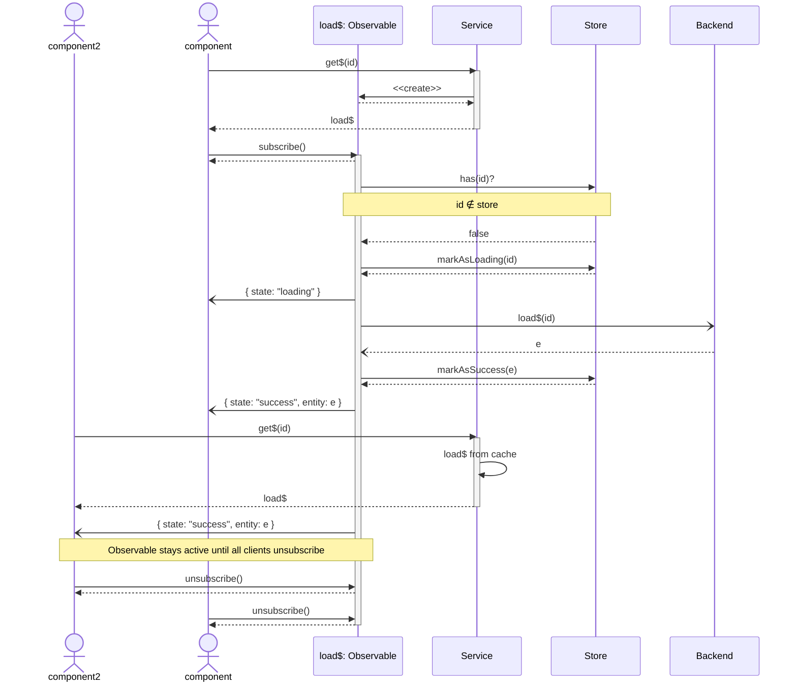

# Store

Reactive Stores realized with [NgRx](https://ngrx.io/).

## Basic terminology

- Prefix "ensure" (ex. ensureProductsLoaded): Ensures that the Entities are loaded, i.e. if they are already present, no new http request is made.

## Basic rules

- Don't export too much. E.g., "loadProductsSuccess" is not relevant outside the lib, so it shouldn't be exported.

# Service Wrapper

## Load single entity

The service adds a wrapper around the store. The `get$` method returns an observable that triggers the fetching of the entity from the server. The observable also updates the store with the correct states (loading, success and error).

A second call of `get$` with the same id will return the same observable as the first call.

